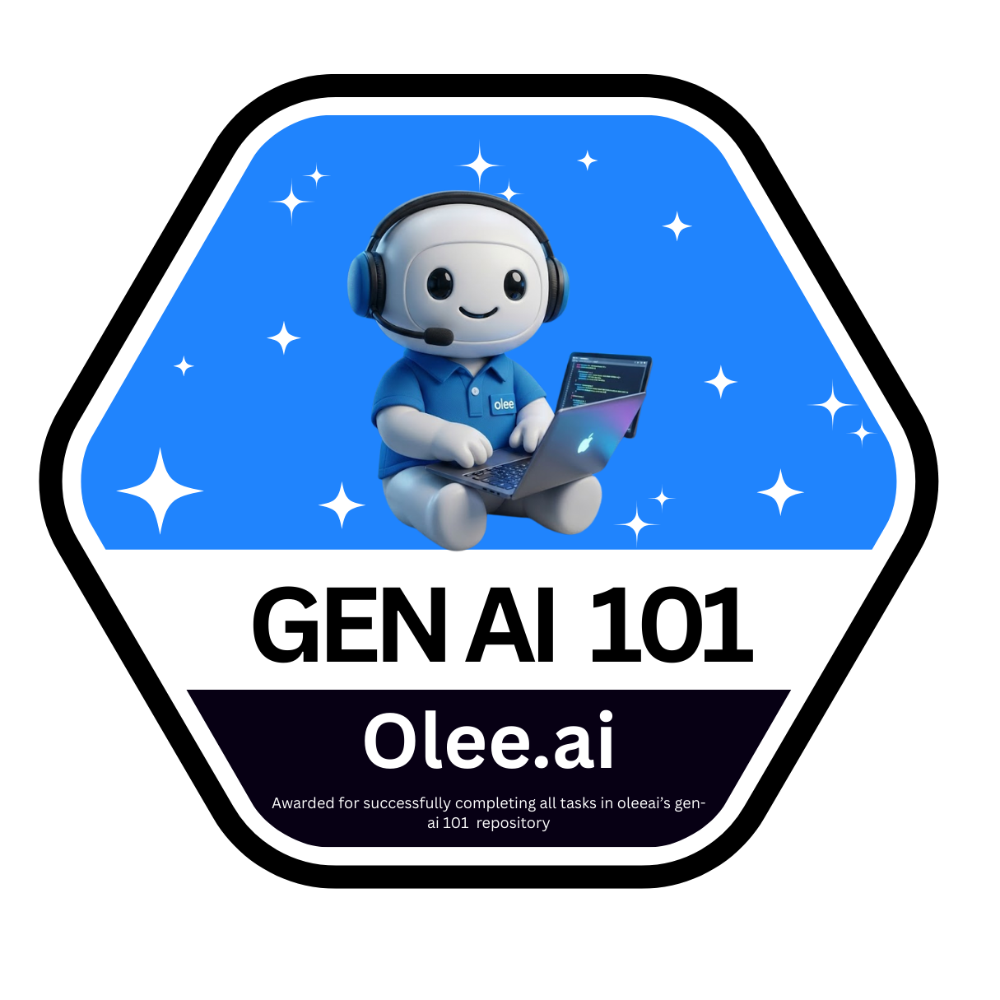
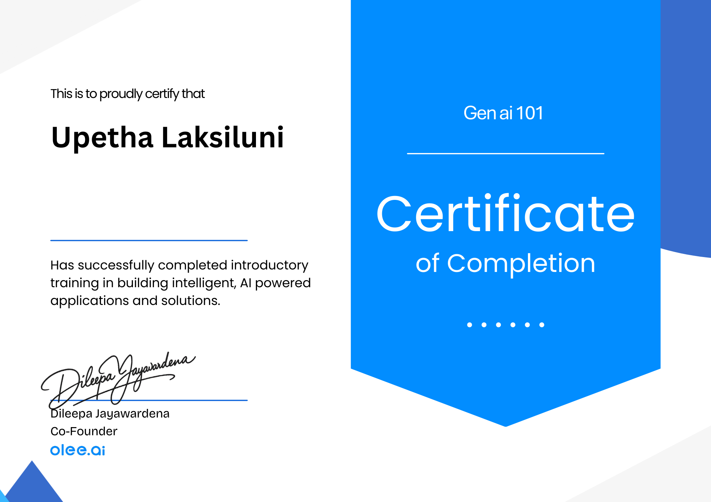

# 👋 Hi, I'm Upetha Laksiluni

  

  

---

## 🌟 About Me

I’m **Upetha Laksiluni**, a **Full-Stack Developer** from **Sri Lanka 🇱🇰** focused on building scalable, modern web applications with clean architecture, strong UI/UX, and production-ready standards.

- 🔭 **Working on:** Eco-tour (Sustainable tourism platform)  
- 🌱 **Learning:** Go, Redux, Ruby, Swift, Laravel, Next.js, React Native, Django, Docker, Vue.js  
- 👯 **Open to:** Collaborations & open-source  
- 💬 **Ask me about:** JavaScript, TypeScript, Next.js, React, Angular, Java, Spring Boot  
- ⚡ **Fun fact:** I debug with `console.log()` 🐛  

---

## 🌐 Portfolio

🚀 **Live Portfolio Website**  
A modern, SEO-optimized portfolio built with **Next.js**, **3D animations**, and advanced UI effects.

👉 **Visit:** https://upetha-laksiluni-portfolio.vercel.app

### ✨ Highlights
- Next.js App Router architecture  
- Interactive 3D loader (Three.js / React Three Fiber)  
- Smooth motion animations & UI effects  
- Full SEO (Open Graph, Twitter Cards, Sitemap, JSON-LD)  
- Auto-loaded GitHub projects via API  
- Deployed on Vercel  

---

## 🧾 Certifications

📄 **Certification Documents (PDF)**  
➡️ **[View My Certifications](certification/Upetha_Laksiluni_Certifications.pdf)**

**Key learning areas covered:**
- Linux Fundamentals  
- Node.js & SQLite Database Development  
- Generative AI & Large Language Models (LLMs)  
- Cloud & DevOps Foundations  

  

---

## 🧠 Tech Stack

### Languages

### Frontend

### Backend

### Mobile

### Databases

### Tools & Cloud

---

## 💬 Ask Me About

  

---

## 📊 GitHub Analytics

  
  

  

  

---

## 🐍 Contribution Snake

  <picture>
    <source media="(prefers-color-scheme: dark)" srcset="github/snake-dark.svg">
    <source media="(prefers-color-scheme: light)" srcset="github/snake.svg">
    
  </picture>

---

## 🌐 Connect With Me

---

  <h3>“Code is like humor. When you have to explain it, it’s bad.” – Cory House</h3>

⭐ If you like my work, consider following me and checking out my portfolio.  
Thanks for visiting — let’s build something meaningful together!

